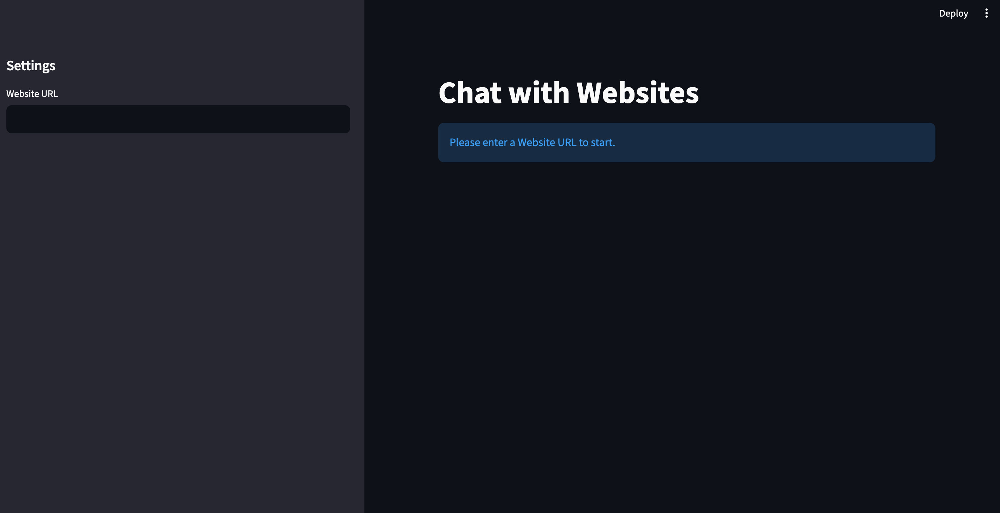
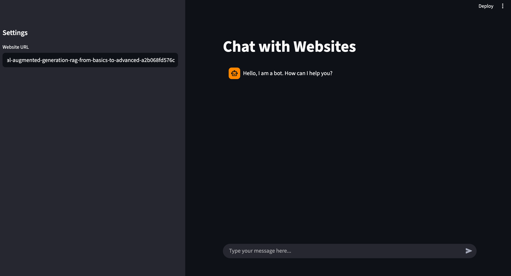
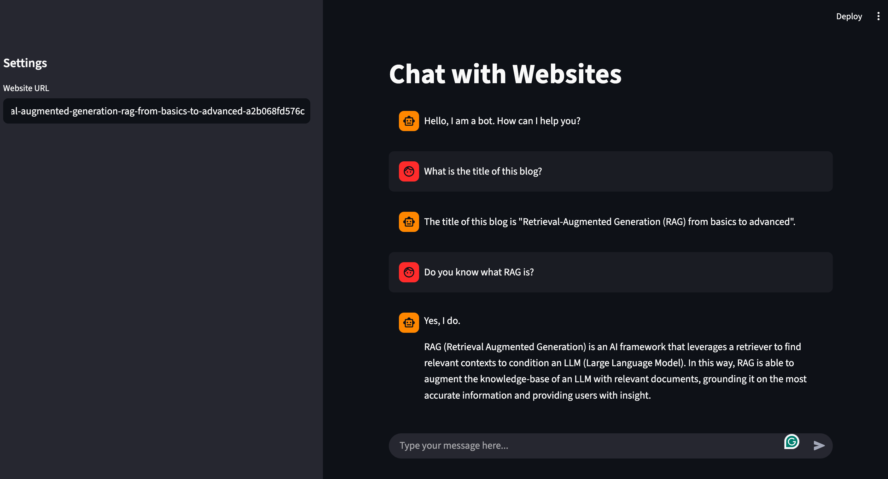

# Chat with Website

This project is a Streamlit application that allows users to chat with any website. You provide a URL and a Google API key, and the application uses a Retrieval-Augmented Generation (RAG) model to answer questions based on the site's content. It uses `cloudscraper` to bypass anti-bot measures, ensuring robust access to website data.

## Demo

**Step 1: Initial Setup**
On first run, the application prompts you to enter a Google API Key and the URL of the website you want to chat with.



**Step 2: Loading Website Content**
Once you provide a URL, the application fetches and processes the website's content to create a vector store.



**Step 3: Chatting with the Website**
You can now ask questions about the website's content, and the AI will respond based on the information it has processed.



## About The Project

This application leverages a Retrieval-Augmented Generation (RAG) model to provide a conversational interface to website content. The core idea is to combine the power of large language models (LLMs) with external knowledge, in this case, the content of a website.

Here's a brief overview of how it works:

1.  **Website Content Ingestion**: The application first fetches the content from the provided URL.
2.  **Vectorization**: The text content is then broken down into smaller chunks, and each chunk is converted into a numerical representation (an embedding) using a text embedding model.
3.  **Vector Store**: These embeddings are stored in a vector store, which is a specialized database that allows for efficient searching of similar vectors.
4.  **Conversational AI**: When a user asks a question, the application converts the question into an embedding and uses the vector store to find the most relevant chunks of text from the website. These chunks, along with the chat history, are then passed to an LLM to generate a human-like response.

This approach allows the LLM to answer questions based on the specific content of the website, making the responses accurate and relevant.

## Tools and Technologies

The application is built with Python and leverages several key technologies:

-   **Streamlit:** Used for creating the interactive web interface.
-   **Cloudscraper & BeautifulSoup:** Used to scrape website content, with `cloudscraper` providing a way to bypass anti-bot services like Cloudflare.
-   **Langchain:** The core framework used to build the application. It provides tools for document loading, text splitting, vector store integration, and orchestrating the different parts of the RAG chain.
-   **Google Gemini Models:** The application uses Google's Generative AI models for both embeddings and chat.
    -   `models/gemini-embedding-001`: Used to create vector representations of the website content.
    -   `gemini-2.5-flash`: Used as the chat model to understand and generate responses.
-   **Chroma:** A vector store used to store the embedded website content for efficient retrieval.

## How it Works

The application's logic is orchestrated using LangChain expressions, which provide a declarative way to compose chains.

1.  **`get_vectorstore_from_url`**: This function takes a URL and a Google API key. It uses `cloudscraper` to fetch the webpage's HTML, then parses it with `BeautifulSoup` to extract the text. The text is then split into chunks with `RecursiveCharacterTextSplitter`, and a `Chroma` vector store is created using `GoogleGenerativeAIEmbeddings`.

2.  **`get_context_retriever_chain`**: This function creates a history-aware retriever. It takes the chat history and the user's input, and generates a search query to look up relevant information. It uses `create_history_aware_retriever` which combines the LLM with the retriever.

3.  **`get_conversational_rag_chain`**: This is the main chain that generates the response. It uses `create_retrieval_chain` to combine the retriever chain with a document stuffing chain. The `create_stuff_documents_chain` takes the retrieved documents, the chat history, and the user's input, and "stuffs" them into a prompt that is then sent to the LLM to generate the final answer.

## Usage

1.  **Prerequisites:**
    *   Python 3.7+
    *   pip

2.  **Installation:**

    Clone the repository and install the required Python libraries from the `requirements.txt` file.

    ```bash
    git clone https://github.com/your-username/chat-with-website.git
    cd chat-with-website
    pip install -r requirements.txt
    ```

    **For Conda Users:**

    If you prefer to use Conda for environment management, you can create and activate a new environment, then install the dependencies:

    ```bash
    conda create -n chat-with-website python=3.9 -y
    conda activate chat-with-website
    pip install -r requirements.txt
    ```

3.  **Set up Google API Key:**

    You will need a Google API key to use the Gemini models. You can get one from [Google AI Studio](https://aistudio.google.com/app/apikey).

    The application will first look for a `GOOGLE_API_KEY` environment variable. You can set this in a `.env` file in the project root. Create a file named `.env` and add the following line:
    ```
    GOOGLE_API_KEY="your_api_key_here"
    ```
    If the environment variable is not found, the application will prompt you to enter your API key in the sidebar of the web interface.

4.  **Running the Application:**

    To start the application, run the following command in your terminal:

    ```bash
    streamlit run src/app.py
    ```

    The application will open in your web browser. Enter a website URL to begin chatting.